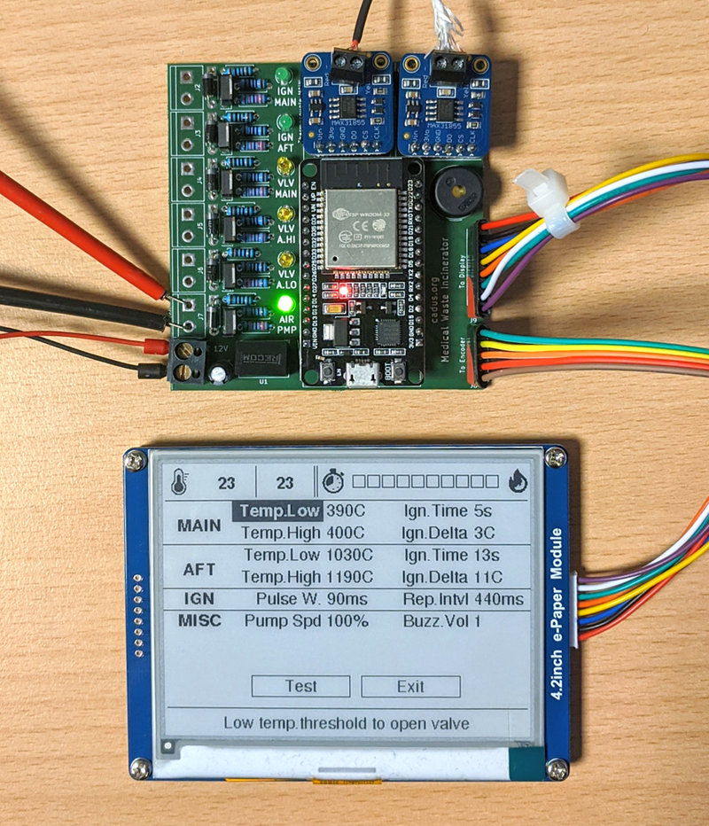

# Firmware & electronics for the CADUS incinerator

Furnace for the incineration of medical waste.

## Project Docs
Project documentation is available on [GitHub pages](https://cadus.github.io/incinerator/)

**Under construction / Work in progress**

